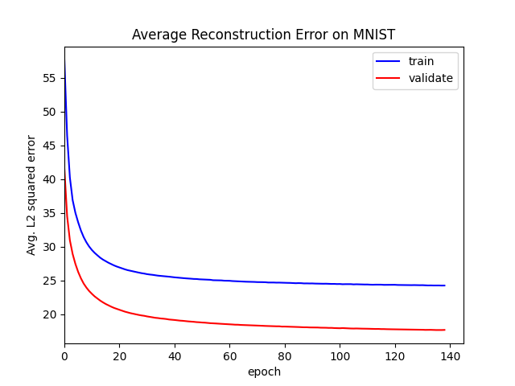
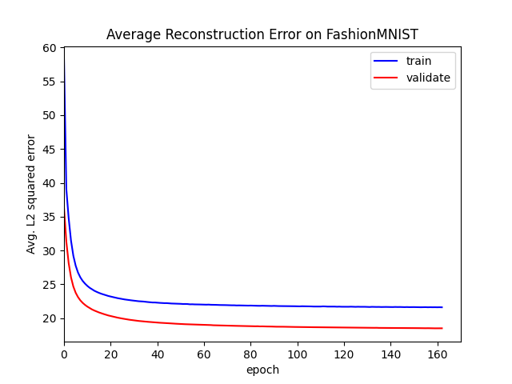
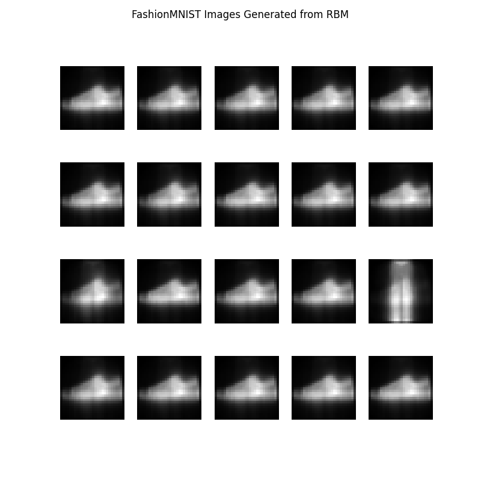

# Restricted Boltzmann Machines

See the accompanying [post](https://davidtranhq.github.io/2022/05/23/restricted-boltzmann-machines.html) for this model.

A **restricted Boltzmann machine** implemented with PyTorch. Trained with contrastive divergence, momentum, L2 weight decay, and early stopping.

`models/` contains saved model parameters trained on the MNIST and FashionMNIST datasets. The loss and generated examples for each model is pictured below.

