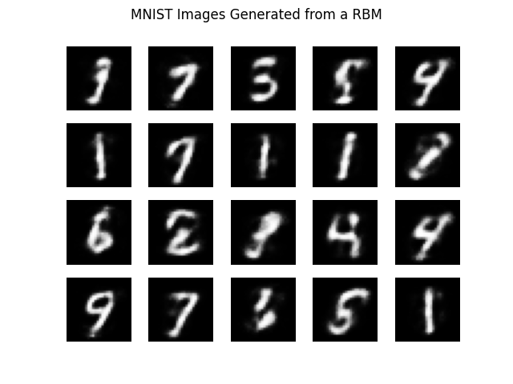
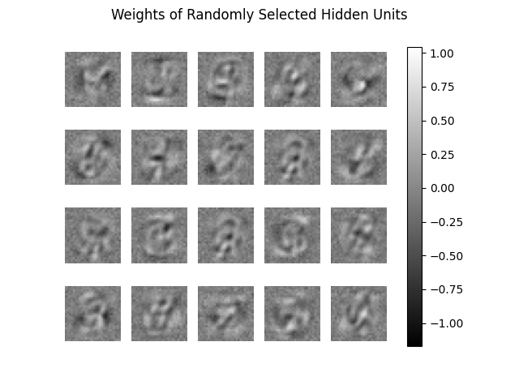

# Restricted Boltzmann Machines

See the accompanying [post](https://davidtranhq.github.io/2022/05/23/generating-images-with-restricted-boltzmann-machines.html) for this model.

A **restricted Boltzmann machine** implemented with PyTorch. Trained with persistent contrastive divergence, momentum, and L2 weight decay.
`models/` contains the model parameters and the hyperparameters for a model trained on the MNIST dataset. The loss and generated examples for each model is pictured below.

Images generated from the model:

Images reconstructed from the model:

L1 loss of the model

Visualization of the weights in random hidden units:

